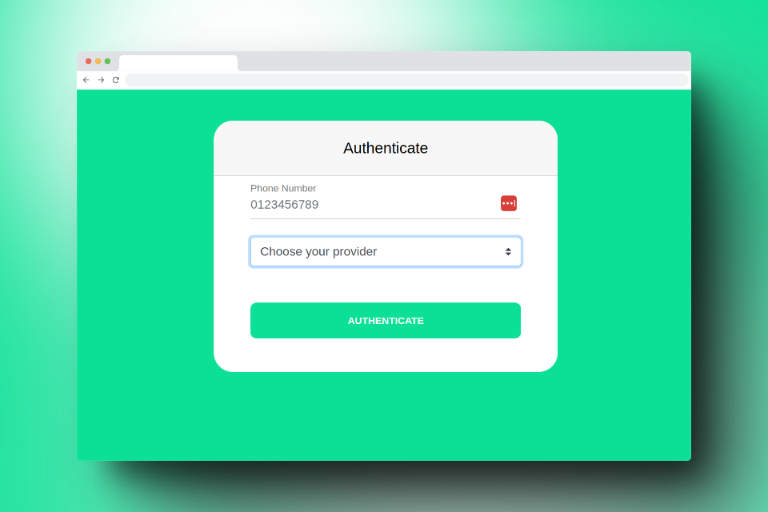

# SPIKE API Integration in Fast API

## Spike API Integration

This documentation provides instructions on how to integrate with the Spike API. To get started, create an account by signing up at https://spikeapi.com. Once approved, you'll have access to the Spike developer console and credentials to begin using the API.

### Integration Initialization

To establish connections with data providers, applications need to launch the integration flow, which entails opening Spike's integration webpage on the user's browser. The following parameters are required:

- `client_id` (string): App ID for your team.
- `provider` (string): Name of the data provider.
- `user_id` (string): A unique ID representing the end user. Typically, this will be a user ID number from your application. Personally identifiable information should not be used in the `user_id`.

### Providers

The following providers are available:

| Provider | Short name |
| --- | --- |
| Apple Health* (SDK) | apple |
| Android Health Connect* (SDK) | health_connect |
| Dexcom | dexcom |
| Dexcom Sandbox | dexcom_sandbox |
| Fitbit | fitbit |
| Garmin | garmin |
| Google Fit | google_fit |
| Oura | oura |
| Polar | polar |
| Spotify | spotify |
| Strava | strava |
| Withings | withings |
| Whoop | whoop |
| Suunto** | suunto |
| Omron** | omron |
| Wahoo** | wahoo |
| Biostrap** | biostrap |
| Samsung Health (Data is available via Health Connect SDK) | - |
| MyFitnessPal (Data is available via Health Connect SDK) | - |

*Please use iOS SDK (Swift, React Native, Flutter, or Android-Kotlin) to connect to Apple Health and Android Health Connect.

**Request access

# Installation

1. Clone the repository.
2. (Optional) Create and activate virtual environment by running `python -m venv .venv` and then `source .venv/bin/activate`
2. Install the required dependencies by running `make install`.

## Usage

1. Run the application with `make run`. or `make run-docker`
2. Access the application at `http://localhost:5000`.

## Testing

1. Run the tests with `make test`.

## Code Formatting

1. Format the code with `make format`.

## Code Linting

1. Lint the code with `make lint`.

## Refactoring

1. Refactor the code with `make refactor`.

## Deployment

1. Deploy the application with `make deploy`.

## Contributing

1. Fork the repository.
2. Create a new branch.
3. Make your changes and commit them.
4. Push to your fork and submit a pull request.

## License

This project is licensed under the [MIT License](LICENSE).
